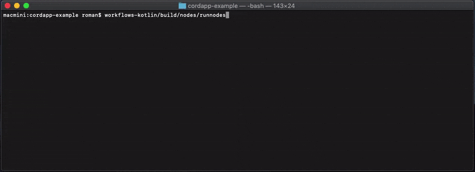

  

# Sample CorDapp Application

Here we have 3 organisations sending messages to each other.
Nodes are basically running on a single system, however it is easy to change (see Corda's tutorials).

## See demo
[Here](demo/readme.md)

## Run
1. `deployNodes` with Gradle
2. Run `workflows-kotlin/build/nodes/runnodes`
3. `runAliceServer` (same for `Bob`, `Eve`, `TovarischMajor` and `GreatFirewall`) with Gradle
4. Go to `localhost:500005` (and also `:50006`, ..., `:50009`)

