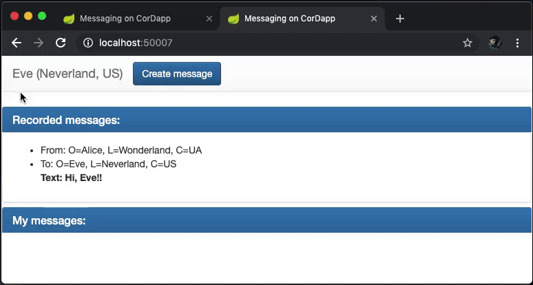
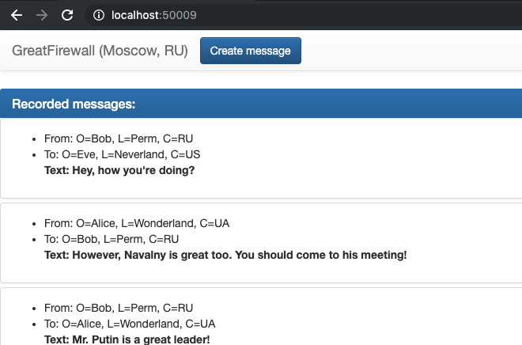
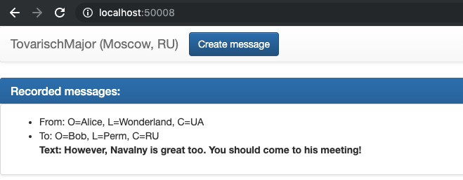
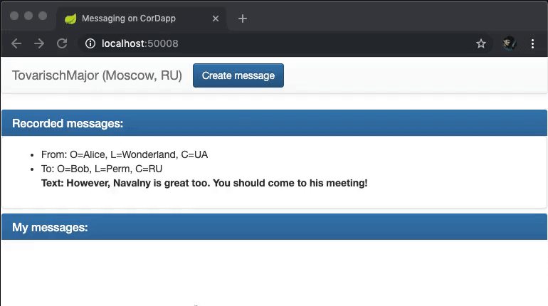
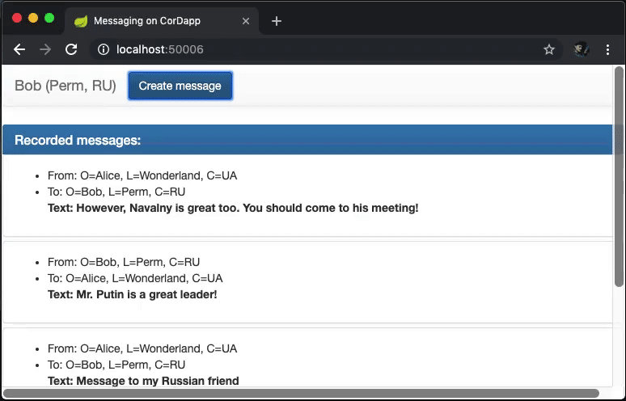
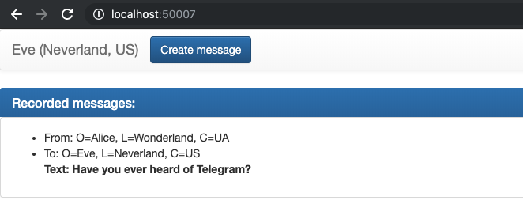

# Demonstration

App runs 5 nodes:
- Alice
- Bob
- Eve
- TovarischMajor
- GreatFirewall

## Alice, Bob and Eve
They live in the different countries, they chat using **messages as contracts**. If Alice texts Eve, they *both sign* a transaction of contract creation.
Bob is not involved, so he can't see their messages and *his signature is not required*.

## Supervisors
As this messenger is developed in Russia, all transactions are supervized. After contract is signed by sender and receiver, a transaction is sent to **controlling nodes** *(their signature is not required)*.
Any message sent from/to Russia can be seen at GreatFirewall dashboard.

Some of these messages which seem to be dangerous can be viewed at TovarischMajor dashboard.

Supervisors can't send messages though.

Messages sent from/to Russia can't contain prohibited content (that is, contain dangerous words ~~like bomb, Telegram~~) by application design.

But in the modern *(outside Russia)* blockchain world it is legal to chat about anything.

